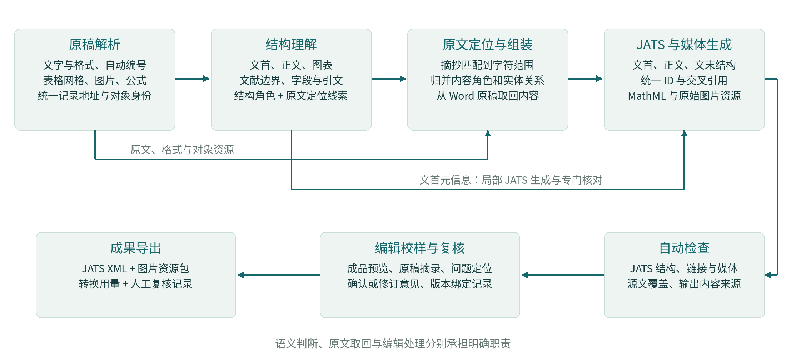
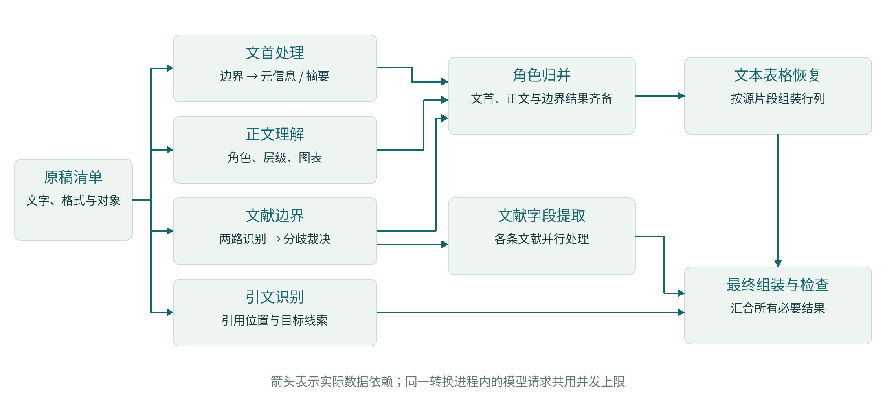
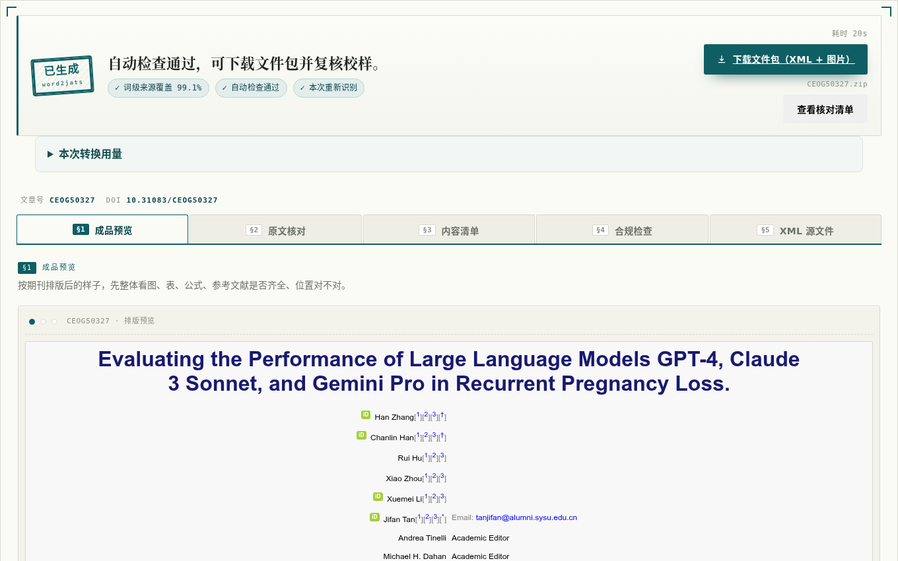
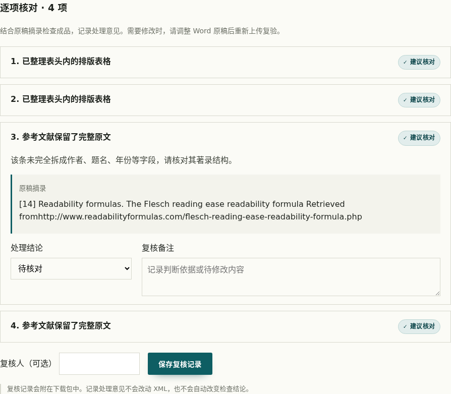

# word2jats：面向学术出版的 Word 智能结构化转换

学术期刊结构化技术创新大赛 · 选题一 · 技术方案说明书

参赛团队：JiangLab

在线原型：https://word2jats.jianglab.work

## 一、项目目标与方案概述

### 1.1 从投稿文档到出版数据

学术论文在 Word 中主要通过排版表达含义：标题的字体和位置体现章节层次，作者姓名后的角标对应单位或通讯说明，表格的合并单元格表达分组关系，正文中的编号指向图表与参考文献。出版系统需要的则是能够检索、链接、重用和重新排版的结构化数据。Word 转换为 JATS XML 的关键，是把这些隐含关系恢复为明确的出版结构，同时保留论文内容。

word2jats 面向这一过程，接收 DOCX 稿件，生成符合 JATS Journal Publishing 1.3 的 XML 文档及配套图片资源，并提供网页校样、原稿对照、复核记录和结果导出。编辑可以在同一工作台完成稿件提交、结构化转换和结果检查；技术人员也可以通过命令行调用相同的转换流程。

项目将任务分为三个相互关联的目标。第一是内容完整：文字、数字、图表和公式在转换中有明确去向。第二是结构可用：章节、作者单位、文献字段和交叉引用能够被出版系统直接读取。第三是加工高效：利用模型完成语义识别，利用程序完成重复性组装与检查，并将需要编辑判断的事项定位到原稿。

### 1.2 技术路线与主要贡献

方案采用“语义识别与内容取回分离”的设计。模型读取带位置标识的原稿清单，判断内容角色、边界和关联；程序将定位线索解析为原稿中的字符范围，再据此组织正文、摘要与文献等内容。作者、单位及通讯关系使用受约束的文首生成流程，适配复杂的关系结构。

这一设计形成三项相互支撑的技术贡献：

- **以原文位置连接识别与生成。** 模型的结构判断可以调整，正文与文献的内容取回仍依据 Word 原稿；同一位置表示也用于后续检查和原稿定位。
- **以内容对象组织整篇论文。** 统一处理文字范围、表格网格、图片与公式的出现位置，以及作者、图表、文献之间的关系，完成从局部识别到整篇 JATS 文档的组装。
- **以任务依赖和编辑流程组织自动化。** 文首、正文、文献与引文按依赖并行处理；生成结果进入可视化校样，编辑能够查看原文、处理具体事项并导出成果。

原型提供 Qwen 与 DeepSeek Flash 两种模型配置。模型适配、用量计量、XML 生成与编辑操作使用统一接口，便于根据转换质量、时间和资源消耗选择运行配置。

## 二、总体架构与数据组织

### 2.1 分层处理流程

系统划分为原稿解析、结构理解、定位组装、生成检查和编辑工作台五个部分。它们之间传递的是带有原稿位置和对象身份的数据，而不只是中间文本。



原稿解析层读取 DOCX 的文字、样式、编号、表格和嵌入资源，形成统一的原稿记录。结构理解层对这些记录进行任务化识别。定位组装层将各任务结果归并为语义文档，生成层再将语义对象映射为 JATS 元素，外部化图片并建立引用。自动检查和网页复核围绕同一份输出展开。

这套分工兼顾了两类信息：一类是 Word 中可以直接读取的事实，例如单元格合并、图片字节和公式对象；另一类是需要结合上下文理解的含义，例如一行文字究竟是章节标题、图注还是作者单位。前者由程序解析，后者由模型识别，二者在组装阶段结合。

### 2.2 原稿记录：位置、内容与对象分开表示

解析器为段落、表格单元格及附属文本建立稳定地址。例如，`doc/p30` 表示正文部件中的一条段落记录；一段文字进一步用“记录地址、起始位置、结束位置”定位。字符范围采用左闭右开的表示，范围内的内容可以直接从原稿取回。

模型输入清单保留记录地址，并附带有效格式、提纲级别、编号等信息。Word 样式先经过继承关系解析，再作为识别依据提供给模型。因此，标题识别既能利用 Word 已有结构，也能结合上下文处理不规范样式，而不依赖固定的样式名称。

图片和公式分别记录“资源”与“出现位置”。资源对应实际字节或原生公式内容；出现位置说明它位于哪段文字、哪个单元格，以及在文档中出现的顺序。同一图片被引用多次时，可以复用资源并保留多个位置；一张复合图由多个图像组成时，也可以归入同一个图对象。

### 2.3 语义文档与 JATS 映射

各识别任务的结果最终归并为统一的语义文档。语义对象包括章节、段落、图、表、公式、注释、定义列表、文献条目和引用关系。文字对象引用原稿范围，图片对象引用资源出现记录，关系对象引用目标实体。

| 稿件内容 | 中间表示的重点 | JATS 输出结构 |
|---|---|---|
| 题名、作者、单位、通讯信息 | 字段与人员、机构的关联 | article-meta、contrib、aff、author-notes |
| 摘要与关键词 | 摘要分段、分节及各关键词的原文位置 | abstract、sec、kwd-group |
| 章节与正文 | 标题层级、段落顺序、行内格式 | body、sec、title、p |
| 表格 | 行列、合并区域、表头、表题和表注 | table-wrap、table、thead、tbody |
| 图片与复合图 | 图对象、组成图片、编号与图注 | fig、fig-group、graphic、caption |
| 数学公式 | 行内或行间位置、数学结构或图像载体 | inline-formula、disp-formula、MathML |
| 定义列表与文末声明 | 术语—释义关系、声明标题与内容 | def-list、def-item、ack、fn-group 等 |
| 文献与交叉引用 | 条目、著录字段、引用位置与目标 | ref-list、ref、element-citation、xref |

生成器统一分配内部标识，并将原稿中的显示编号与内部身份分开管理。例如，正文可保留“[6–8]”的原有写法，同时通过一个引用元素关联三条文献实体。显示形式与机器可读取的关系可以同时保留。

## 三、核心转换方法

### 3.1 原文定位与内容组装

结构识别的输出包括记录地址、原文摘抄以及必要的前后文。程序先在指定记录中精确查找摘抄；遇到空白、引号或连字符的等价写法时，进行受控归一化匹配；出现重复文字时，再结合位置线索、邻接内容和先后顺序确定对应范围。最终用于组装的文字取自匹配到的原稿位置。

例如，一份稿件中的 `doc/p30` 记录为“2. Materials and Methods”。正文任务将其识别为章节标题，组装器保留该记录的文字并建立章节对象，生成如下结构（省略正文）：

```xml
<sec id="S2">
  <title>2. Materials and Methods</title>
  <p>……</p>
</sec>
```

其中，章节角色由模型判断，标题文字由原稿取回，章节标识由生成器分配。对于同一段落内的部分文字，例如参考文献中的题名、年份或正文中的一处引文，则定位到字符子区间。这样既能进行细粒度标注，也能保留未被标注的上下文。

多个任务可能对相邻区域作出不同判断，系统会在整篇组装前归并角色与范围，处理文首、正文、图表说明和文献之间的边界冲突。生成后还会核对各范围的使用情况，使局部处理能够与全文内容衔接。

### 3.2 文首元信息、作者与通讯关系

文首处理先确定元信息区域和摘要关键词区域，再分别处理两类内容。元信息不仅是若干字符串，还包含关系：一位作者可以属于多个机构，多位作者可以共享一个单位，通讯说明可能位于单独段落，ORCID、邮箱和个人地址也可能分散出现。

模型依据限定的文首区域生成局部 JATS 结构，将姓名、学位、标识和角色归入对应人员，将机构信息组织为 `aff`，并以 `xref` 连接作者、单位和通讯说明。姓名可以可靠拆分时使用姓与名字段；适合整体表示时采用 `string-name`。日期按照收稿、修回、录用等事件类型组织，而非依赖原稿中日期分量的书写顺序。

局部结果经过 JATS 内容模型校验；结构错误会连同具体校验信息返回模型修正。生成器还核对原稿内容及标识，处理格式角标与相邻文字的边界，并记录需要复核的修正。ORCID 作为人员标识保留在 `contrib-id` 中，作者姓名、单位关联和通讯关系分别参与质量评价。

摘要和关键词采用原文定位方式。结构化摘要识别各小节的标题与内容；普通摘要保留段落组织；图文摘要保留与其对应的图片资源；关键词按各词项的范围生成 `kwd`。这些内容与文首元信息可以在边界确认后并行处理。

### 3.3 正文章节、格式与特殊内容

正文任务结合全文上下文和 Word 格式事实，判断章节标题、普通段落、图表说明、公式及文末声明等角色。章节层级由内容与排版信息共同确定，随后按照原稿顺序建立章节树。图题、表题、摘要标题与正文标题分别归属对应对象，避免仅凭加粗或居中样式将它们归入同一种结构。

行内格式与文字内容一同按原稿范围取回。生成时，根据语义位置处理格式：章节标题的整体外观可以由预览样式控制；正文中实际承载含义的斜体、上下标等保留为行内标记；数学对象进入公式结构。Word 自动编号从编号定义读取，用于恢复文献等条目的显示编号。

术语表与定义列表按术语—释义关系组织；作者贡献、利益冲突、伦理、数据可用性及资助等声明，按识别到的标题和所属内容生成文末结构。处理重点是保留原文内容和先后关系，同时让不同业务内容具有可识别的结构位置。

### 3.4 表格：保留逻辑网格，恢复文本排表

Word 稿件中的表格具有不同载体。原生表格已经包含行、列和合并关系，系统读取这些结构事实，按逻辑网格生成 JATS 表格。横向和纵向合并分别映射为列跨度和行跨度；表头、行头、表题及表注由结构理解结果补充。单元格内的文字、上下标和公式继续使用相同的内容取回机制。

另一类表格以制表符、空格或软换行排出，原文件中没有完整单元格结构。系统先识别属于该表的实际文本行，再由专项任务将每行中的原文片段分配到各列。程序核对片段归属和使用情况：同一行的内容应完整进入对应单元格，各片段不得相互重叠或被重复使用。识别结果据此转为行列结构，并保留核对信息供编辑处理。

图像型表格则保留其图片载体，配合表题、编号和表注生成 `table-wrap`。在界面上，三类表格都进入校样预览；结构化网格可直接用于后续排版，文本排表中的疑难项目可结合原稿摘录核对。实验分别考察表格对象、题注和网格单元内容，体现“表存在”和“表结构正确”的不同要求。

### 3.5 图片、复合图与数学公式

图片处理同时解决资源和语义归属。系统从 DOCX 的关联关系取得图片，记录其出现位置，再将图片归入对应的图、表或段落。一张图包含多个面板时，保持组成关系和先后顺序；图编号、图注标题和解释段落分别组织。媒体文件按原字节导出，并将 XML 中的资源路径关联到实际文件。

公式按照载体处理。Word 原生公式使用 Office Math Markup Language（OMML）表达数学结构；系统通过样式表转换为 MathML，并递归组织运算节点。一次变换可能产生多个并列节点，所有节点共同构成完整的数学表达式。行内公式和行间公式分别放入 JATS 对应容器，公式编号与正文引用也保留其关联。

图像型公式使用原始图片承载，放入公式容器并保留其段内位置。例如，同一行公式由两个 WMF 片段组成时，两个资源均参与输出。网页针对 TIFF 和可解码的 WMF 提供浏览器可显示的预览，下载包保留原始文件。由此，预览显示与出版资源交付可以分别满足使用要求。

原生公式的实验同时核对数量与数学树结构；图像型公式核对载体是否保留。这两类结果分别报告，以对应可继续进行数学处理的结构化公式和保留原貌的图像公式。

### 3.6 参考文献：边界识别、字段提取与完整著录

参考文献处理分成两个阶段。首先识别条目边界，两路不同提示分别给出判断；程序将边界定位回原稿，对一致结果直接归并，对分歧进行裁决。条目的身份由其原稿范围确定，编号作为独立的显示信息处理，因此既可以处理显式编号，也可以处理 Word 自动编号或无编号著录。

边界确定后，各条文献并行提取人员、题名、刊名、年份、卷期页、标识和出版信息等字段。字段摘抄需要定位到原稿范围；姓名等重复片段还结合成员范围、顺序与不重叠条件进行分配。原稿已能唯一确定字段位置时直接采用；确有歧义时，再利用模型的顺序提示辅助判断。输出中的字段先后以实际原稿位置为准。

例如，著录片段“European Journal of Preventive Cardiology, 26 (2019) 1191-1204.”分别提供刊名、卷号、年份和起止页。模型返回这些原文片段，程序核对位置并生成下列字段；其中卷号位于年份之前，与原稿一致：

```xml
<source>European Journal of Preventive Cardiology</source>
<volume>26</volume><year>2019</year>
<fpage>1191</fpage><lpage>1204</lpage>
```

这些字段与人员、题名等共同进入 `element-citation`，成为可以单独检索、链接和重新排版的出版数据。

字段化过程同时核对整条著录的内容覆盖。著录中的常规标点和连接记法按明确规则处理，其余内容需要由相应字段承载。对于不适合充分拆分的条目，系统使用 `mixed-citation` 保留整条原文，完整著录仍可在校样中查看和核对。两种形式都具有 JATS 中的合法承载方式，条目完整性与字段化程度分别统计。

### 3.7 正文引文与图表关联

引文识别任务给出正文中的引用位置与目标线索。数字制引用通过原稿显示编号关联文献实体；作者—年份制引用结合作者、年份与引用摘抄匹配目标。对图表的提及则关联对应图、表实体。所有目标在组装阶段转换为文档内部标识。

例如，正文中的“[6–8]”可表示为以下片段，括号保留在周围文字中：

```xml
<xref ref-type="bibr" rid="R006 R007 R008">6–8</xref>
```

这既保留原来的显示范围，也建立三条机器可读取的引用关系。输出检查验证标识唯一性及目标存在性；质量评价进一步按所在段落、引用位置和实际目标进行匹配。这样可以分别衡量链接是否有效，以及它是否指向应当关联的内容。

## 四、运行效率与工程实现

### 4.1 依据实际依赖进行并行调度

一次转换包含多个模型任务，它们对输入结果的依赖并不相同。文首、正文、文献边界和正文引文均可以读取原稿清单并独立开始；文献字段提取只需要文献边界结果；文本表格恢复需要完成正文角色归并；最终组装再汇合所有必要结果。



系统据此组织并行执行。文献字段提取在边界确认后立即启动，与文首及正文的后续处理重叠；文本表格恢复期间，文献字段和引文识别仍可继续运行。等待被限制在实际存在的数据依赖上。

模型请求共用进程级并发上限，默认最多 32 个在途请求。即使文首与正文采用不同客户端实例，也遵守同一上限。长文按照输入预算划分窗口，并在相邻窗口保留上下文；各窗口结果经过原文定位后归并。通过任务级并行与有界请求并发，兼顾单篇处理时间和服务资源占用。

### 4.2 完整响应、限次重试与两级复用

模型输出采用流式接收。程序在响应正常结束后再进行 JSON 或 XML 解析，中断的半截回答不会进入组装。传输异常按类型进行有限重试，并遵循服务端给出的退避信息；结构回答未满足契约时，将具体问题返回模型作限次修正。调用次数和用量包含这些实际发生的额外请求。

系统区分两类复用。应用本地缓存保存完整模型回答，按模型、任务、输入与生成参数确定请求身份，相同请求可以直接复用。原稿修订后，只有输入保持一致的任务能够复用，改变的请求重新执行。模型服务端的上下文缓存则针对实际提交的输入计算命中量，仍然属于一次真实模型调用。两者分别记录，避免将本地复用次数与缓存 Token 混淆。

Token 用量统一记录输入、输出、缓存命中、缓存未命中及总量。原始数据取自模型响应，输入总量划分为缓存命中与未命中两部分。逐请求记录汇总到各模型和整篇稿件，界面与下载包采用一致字段。

### 4.3 可维护的实现与运行方式

转换核心使用 Python，按解析、理解、语义对象、生成、检查和模型接入划分模块。模型提供结构判断，生成器负责标准输出，网页和命令行调用同一个转换入口。因此，调整模型配置不会改变输入文件格式、校样操作或成果格式。

网页采用 FastAPI 提供上传、任务状态、预览、复核保存和下载接口。转换在后台执行，前端可以持续显示进度；大文件采用分片上传和失败重传，并在合并后校验大小与摘要。模型凭据保存在服务端配置中。

每次转换使用独立工作目录，先生成候选 XML 与媒体，再完成结构、内容和资源检查。检查通过后发布结果；需要处理的候选仍保留为可预览的成果，关联具体问题。生成与发布分开，有助于保护已有成果，并使异常处理中保留足够的上下文。

调用适配层按模型支持的响应格式传递统一的输出结构要求，理解层执行相同的本地契约检查。程序通过云端接口使用语言模型，本机承担 DOCX 解析、任务编排、XML 生成、检查和网页服务，不需要部署本地模型权重或 GPU。安装 Python 依赖并配置模型凭据后，可使用 `python -m webapp` 启动工作台，也可以通过命令行处理单篇稿件。运行说明、输入输出示例和依赖清单随原型提供。

### 4.4 内容与结构的联合检查

自动检查分为四组。格式检查验证 XML 良构及 JATS DTD；关系检查验证 ID 唯一性和引用目标；资源检查验证媒体文件存在、格式可识别、字节与原稿一致；内容检查利用原稿范围和输出来源记录，核对原文去向及生成内容的依据。

这套检查与语义识别互补。识别阶段建立章节、字段和关系，检查阶段验证这些结果是否构成完整、可用的成果。检查信息进一步转为编辑工作台中的具体事项，并与原稿摘录关联，形成可操作的校样入口。

## 五、原型与编辑工作流程

### 5.1 一次稿件处理的操作过程

编辑上传 Word，按需要补充 DOI 与期刊信息，并选择处理模型。系统识别完成后，工作台同时提供成品预览、原文核对、内容清单、合规检查和 XML 源文件五个视图。

成品预览以阅读论文的方式呈现章节、图表、公式和文献，支持在结构化结果中浏览关联内容。内容清单帮助编辑检查作者、图表及文献等对象；XML 视图供技术人员核查具体标记。不同视图共用同一份转换结果，编辑无需在多个工具之间重新组织稿件。



### 5.2 把复核工作定位到原稿

需要核对的事项按内容组织，并给出对应的原稿摘录和处理建议。编辑可以针对具体事项记录“待核对”“已核对，保留当前结果”或“需修改后重新转换”，同时填写备注和复核人。

例如，参考文献未充分拆分字段时，编辑可以对照完整著录判断是否满足交付要求；文本表格需要整理时，可以依据原稿摘录在 Word 中调整行列，再重新转换。相同原段落中的同类提示会合并呈现，减少重复阅读。

复核记录与当前 XML 的文件摘要绑定，导出时注明对应版本。原稿修订、自动转换和编辑确认由此形成连续的加工过程，处理意见能够随成果交接。



### 5.3 统一输出与用量可见

成果包包含 JATS XML、配套媒体、转换用量，以及已保存的人工复核记录。Qwen 与 DeepSeek 配置提供相同的操作界面和成果结构；本次转换的输入、输出和缓存用量在结果页展开查看，并同步进入下载包。

技术方案将编辑判断安排在可定位的具体事项上：模型与程序完成结构化加工，工作台提供对照和处理入口，编辑完成专业判断与必要修订。这与期刊的稿件加工、校样确认和成果交接流程相衔接。

## 六、实验设计与定量结果

### 6.1 实验设置与评价方法

实验采用同一批学术论文 DOCX，比较 Qwen 组合配置与 DeepSeek Flash 配置。Qwen 组合的主流程使用 `qwen3.7-plus`，文首使用 `qwen3.8-max`；DeepSeek 配置使用 `deepseek-flash`。两组采用相同的原稿解析、语义任务、组装及检查流程，温度设为 0，关闭思考模式，单篇内部请求并发上限为 32。

运行环境为 Linux x86_64、Python 3.12.7，处理器为 AMD EPYC 9334。模型通过各自服务端接口调用，本机不加载模型权重。每种配置对每篇稿件执行一次完整转换，逐篇用量与输出文件对应保存。

各稿件逐篇转换，每篇使用独立的新响应目录，不复用既有模型回答。转换总耗时从程序开始处理 DOCX 计至生成 XML、媒体与检查结果，不包含上传和人工校样时间。模型服务端缓存按运行时的实际命中量记录。

质量评价按内容类型展开。字段和结构以稿件内容及对应结构标注为参照，匹配前统一排版空白、内部 ID 命名和区间引文的等价表示；正文内容保留另从 DOCX 直接读取文字进行核对；原生公式直接读取 OMML 并核对输出数学树；媒体按资源字节及所属图表核对。各项分别统计正确匹配数、应有数和输出数，召回率为“正确匹配数／应有数”，精确率为“正确匹配数／输出数”。

全文文字保留率按归一化后的词项及出现次数核对，包含正文、文首、表格和文献中的文字，以及进入 DOI、ORCID 等专门标签的内容。该指标与结构、公式及引用指标配合使用。Token 消耗是模型接口返回的用量，与文字保留评价中的词项统计分别计算。

<!-- EXPERIMENT_RESULTS -->

### 6.2 稿件组成与转换质量

本组共 10 篇稿件。表1列出各篇的内容规模；图与表按论文中的逻辑对象计数，公式栏分别列出原生公式数与图像载体部件数。Word 文件中的图片大小、文献数量与排表方式各不相同，因此同时保留逐篇结果与整体汇总。

表1　实验稿件的内容组成

| 编号 | DOCX / MiB | 词项数 | 作者 / 章节 | 图 / 表 | 公式 / 图像部件 | 文献 |
|---|---|---|---|---|---|---|
| 01 | 0.79 | 12,109 | 3 / 15 | 1 / 4 | 10 / 2 | 39 |
| 02 | 2.08 | 11,429 | 5 / 28 | 4 / 8 | 0 / 0 | 69 |
| 03 | 36.87 | 7,950 | 9 / 19 | 5 / 3 | 16 / 0 | 56 |
| 04 | 3.25 | 12,314 | 7 / 9 | 2 / 3 | 0 / 0 | 145 |
| 05 | 0.20 | 7,836 | 4 / 5 | 4 / 14 | 0 / 0 | 27 |
| S01 | 0.49 | 6,763 | 5 / 20 | 3 / 5 | 0 / 0 | 30 |
| S02 | 2.05 | 11,653 | 10 / 25 | 2 / 2 | 0 / 0 | 50 |
| S03 | 2.58 | 8,019 | 6 / 17 | 4 / 1 | 0 / 0 | 22 |
| S04 | 8.39 | 7,819 | 6 / 14 | 6 / 3 | 0 / 0 | 41 |
| S05 | 3.17 | 7,155 | 9 / 15 | 4 / 3 | 0 / 0 | 46 |


表2　全文分项结构结果（单元格为“正确匹配数 / 输出数；召回率”）

| 评价项 | 应有数 | Qwen 组合 | DeepSeek Flash |
|---|---|---|---|
| 题名 | 10 | 10 / 10；100.00% | 10 / 10；100.00% |
| 作者姓名 | 64 | 64 / 64；100.00% | 64 / 64；100.00% |
| 作者顺序 | 64 | 64 / 64；100.00% | 64 / 64；100.00% |
| 作者单位 | 36 | 36 / 36；100.00% | 36 / 36；100.00% |
| 作者—单位关系 | 106 | 106 / 106；100.00% | 106 / 106；100.00% |
| 通讯作者—邮箱关系 | 17 | 17 / 17；100.00% | 17 / 17；100.00% |
| 作者—ORCID 关系 | 38 | 38 / 38；100.00% | 38 / 38；100.00% |
| 稿件日期 | 26 | 26 / 26；100.00% | 26 / 26；100.00% |
| 摘要内容 | 12 | 12 / 12；100.00% | 12 / 12；100.00% |
| 摘要分段与分节 | 12 | 12 / 12；100.00% | 12 / 12；100.00% |
| 关键词 | 50 | 50 / 50；100.00% | 50 / 50；100.00% |
| 章节层级与标题 | 167 | 167 / 167；100.00% | 167 / 167；100.00% |
| 章节顺序 | 167 | 167 / 167；100.00% | 167 / 167；100.00% |
| 术语—释义条目 | 62 | 62 / 62；100.00% | 62 / 62；100.00% |
| 文末声明与附属章节 | 57 | 57 / 57；100.00% | 57 / 57；100.00% |
| 图对象 | 35 | 35 / 35；100.00% | 35 / 35；100.00% |
| 图注内容 | 35 | 35 / 35；100.00% | 35 / 35；100.00% |
| 表对象 | 46 | 46 / 46；100.00% | 46 / 46；100.00% |
| 表题内容 | 46 | 46 / 46；100.00% | 46 / 46；100.00% |
| 表注内容 | 33 | 31 / 33；93.94% | 31 / 33；93.94% |
| 表格网格位置与内容 | 2,922 | 2,260 / 2,375；77.34% | 2,725 / 2,791；93.26% |
| 图片资源及图表归属 | 48 | 48 / 48；100.00% | 48 / 48；100.00% |
| 原生公式数学树 | 26 | 26 / 26；100.00% | 26 / 26；100.00% |
| 公式图片资源 | 2 | 2 / 2；100.00% | 2 / 2；100.00% |
| 参考文献条目覆盖 | 525 | 525 / 525；100.00% | 525 / 525；100.00% |
| 文献著录字段 | 3,188 | 3,158 / 3,168；99.06% | 3,087 / 3,097；96.83% |
| 正文—文献引用关系 | 817 | 755 / 799；92.41% | 769 / 813；94.12% |
| 正文—图表引用关系 | 108 | 108 / 108；100.00% | 108 / 108；100.00% |


正确匹配数与输出数之比即精确率；召回率反映应有内容中得到正确结构化表示的比例。文献字段包括作者名单、题名、刊名、年份、卷期、页码或文章位置、DOI、PMID及出版者；同一语义字段的标签分拆与等价写法先统一，再进行匹配。引用关系在对齐的可见段落和字符位置上核对实际目标，区间引用展开为各条目标关系。

表3　整体内容保留与标准符合性

| 指标 | Qwen 组合 | DeepSeek Flash |
|---|---|---|
| 全文文字保留率 | 99.73% | 99.71% |
| JATS DTD 合法文档 | 10 / 10 | 10 / 10 |
| 已导出媒体的原字节一致性 | 50 / 50 | 50 / 50 |


分项结果区分了内容保留与结构加工：表题和表对象识别后，还需核对单元格的行列归属；文献条目保留后，还需考察各著录字段与正文引用。编辑工作台据此提供原稿对照和具体核对入口，将自动加工与校样处理连接起来。

### 6.3 转换耗时与本机资源占用

表4　逐篇转换耗时及实际模型请求次数

| 编号 | Qwen / 秒 | DeepSeek / 秒 | Qwen 请求数 | DeepSeek 请求数 |
|---|---|---|---|---|
| 01 | 100.78 | 29.70 | 51 | 50 |
| 02 | 145.92 | 340.24 | 78 | 86 |
| 03 | 87.98 | 29.19 | 64 | 64 |
| 04 | 429.68 | 52.30 | 159 | 156 |
| 05 | 225.19 | 31.60 | 58 | 53 |
| S01 | 61.87 | 13.03 | 41 | 38 |
| S02 | 86.72 | 25.48 | 59 | 59 |
| S03 | 46.50 | 19.86 | 32 | 32 |
| S04 | 77.67 | 21.77 | 52 | 53 |
| S05 | 96.65 | 19.49 | 54 | 53 |
| 平均 | 135.90 | 58.27 | — | — |
| 中位数 | 92.31 | 27.34 | — | — |


在本组稿件及运行条件下，DeepSeek Flash 的平均转换时间为 Qwen 组合的 42.9%，平均耗时缩短 57.1%。该比较使用相同的转换流程和并发上限，体现两种模型配置在本任务中的整体处理差异。

本机资源仅统计转换进程。CPU 时间为用户态与内核态耗时之和；驻留内存以 0.1 秒间隔采样，取每篇执行期间的峰值。模型推理在服务端完成，本机数据对应文档解析、请求编排、生成及检查。

表5　本机资源与请求汇总

| 指标 | Qwen 组合 | DeepSeek Flash |
|---|---|---|
| 平均 CPU 时间 / 秒 | 9.55 | 23.85 |
| 单篇驻留内存峰值范围 / MiB | 162.0–270.1 | 160.1–273.7 |
| 模型请求总次数（含重试） | 648 | 644 |
| 限流重试次数 | 2 | 0 |


### 6.4 模型 Token 消耗

以下计量汇总本次转换中实际发生的请求，包含文首专用模型与限次重试。输入总量等于缓存命中与缓存未命中之和，总量为输入与输出之和；缓存命中已包含在输入中，不再重复相加。所有数值均以 Token 为单位。

表6　Qwen 组合逐篇用量

| 编号 | 输入 | 输出 | 缓存命中 | 缓存未命中 | 总量 |
|---|---|---|---|---|---|
| 01 | 516,193 | 62,357 | 86,016 | 430,177 | 578,550 |
| 02 | 600,588 | 135,549 | 327,936 | 272,652 | 736,137 |
| 03 | 498,410 | 79,729 | 323,968 | 174,442 | 578,139 |
| 04 | 1,004,845 | 245,682 | 302,080 | 702,765 | 1,250,527 |
| 05 | 536,634 | 119,681 | 77,824 | 458,810 | 656,315 |
| S01 | 445,859 | 48,550 | 58,368 | 387,491 | 494,409 |
| S02 | 741,947 | 74,968 | 551,296 | 190,651 | 816,915 |
| S03 | 532,232 | 35,241 | 324,992 | 207,240 | 567,473 |
| S04 | 469,350 | 62,876 | 304,256 | 165,094 | 532,226 |
| S05 | 469,473 | 63,546 | 304,256 | 165,217 | 533,019 |
| 合计 | 5,815,531 | 928,179 | 2,660,992 | 3,154,539 | 6,743,710 |


表7　DeepSeek Flash逐篇用量

| 编号 | 输入 | 输出 | 缓存命中 | 缓存未命中 | 总量 |
|---|---|---|---|---|---|
| 01 | 478,304 | 66,017 | 467,446 | 10,858 | 544,321 |
| 02 | 572,893 | 327,078 | 556,149 | 16,744 | 899,971 |
| 03 | 462,398 | 76,320 | 448,991 | 13,407 | 538,718 |
| 04 | 844,251 | 177,495 | 813,231 | 31,020 | 1,021,746 |
| 05 | 493,241 | 73,263 | 483,189 | 10,052 | 566,504 |
| S01 | 410,265 | 41,235 | 403,067 | 7,198 | 451,500 |
| S02 | 683,649 | 70,606 | 673,004 | 10,645 | 754,255 |
| S03 | 474,720 | 39,539 | 468,093 | 6,627 | 514,259 |
| S04 | 452,484 | 63,363 | 441,968 | 10,516 | 515,847 |
| S05 | 430,137 | 59,002 | 420,072 | 10,065 | 489,139 |
| 合计 | 5,302,342 | 993,918 | 5,175,210 | 127,132 | 6,296,260 |


两种接口在本次响应中均未返回费用金额，表中报告实际 Token 用量。

用量差异与分词规则、各任务的输出长度及发生的重试有关。模型配置的选择因此同时参考分项结构质量、逐篇时间和输入输出规模；工作台以统一字段呈现这些信息，操作流程与成果格式保持一致。

<!-- END_EXPERIMENT_RESULTS -->

### 6.5 技术价值与应用方式

word2jats 将学术论文转换组织为语义识别、原文取回、标准生成和编辑校样的连续流程。源位置表示贯穿内容组装与原稿核对；多任务并行缩短无依赖步骤之间的等待；统一模型适配和用量统计为运行配置选择提供依据。

输出 XML 与媒体可以作为后续排版、内容检索和出版系统集成的基础，网页原型则提供面向编辑的直接使用入口。项目的应用价值体现在将整篇稿件的重复标注工作自动化，并将专业判断保留在有原稿依据、可记录和可交接的编辑环节中。

### 使用的标准与组件

输出依据 NLM 发布的 JATS Journal Publishing 1.3 标签库与 DTD。公式转换采用 OMML2MML 样式表；校样预览采用 JATS Preview Stylesheets；XML 处理、文档解析、图片处理与网页服务使用 lxml、python-docx、Pillow 和 FastAPI 等组件。团队实现原稿记录与语义组织、模型任务编排、原文定位组装、内容与关系检查，以及编辑校样工作台。第三方资源的许可说明随源码保留。

- [JATS Journal Publishing 1.3 标签库](https://jats.nlm.nih.gov/publishing/tag-library/1.3/)
- [DeepSeek Chat Completions API](https://api-docs.deepseek.com/api/create-chat-completion/)
- [千问上下文缓存与用量字段](https://help.aliyun.com/zh/model-studio/context-cache)
